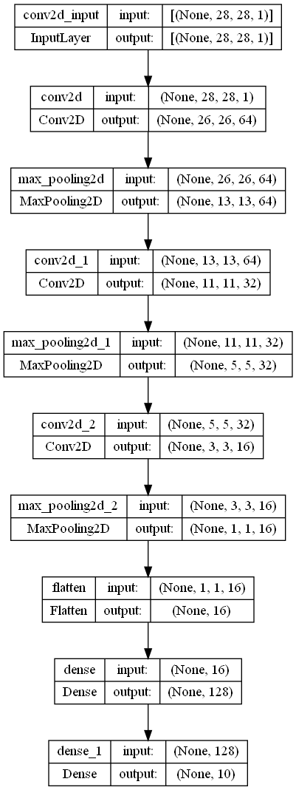
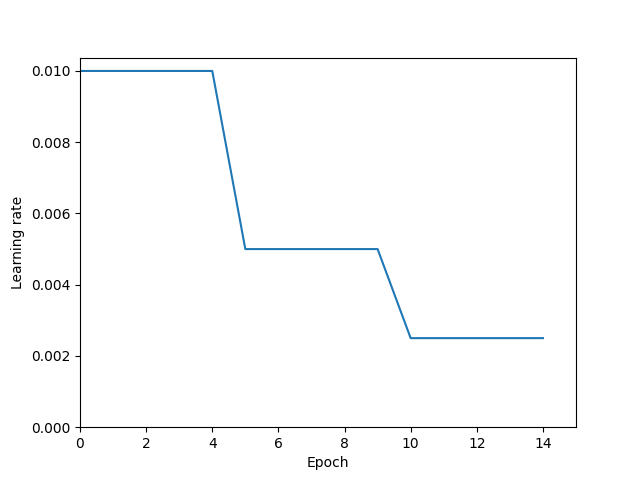

# CNNComputerVision4

GitHub repository for training and evaluation CNNs

## Scripts

- To train any of the five variants, change the `model_variation` variable and run `train_models.py`
- To evaluate a trained model, change the `model_variation` variable and run `evaluate.py`
- To evaluate all five models at once and determine the best model variant, run `evaluate_final.py`
- To train the final two variants with the combined training+validation dataset, run `train_models_final.py`
- To evaluate the final two variants on the test set, run the `test_final.py` file

All trained models can be found in the `models` folder. The history corresponding to these models can be found in the `history` folder. Loss graphs, model summaries and confusion matrices can be found in the `img` folder.

## Baseline model summary

## Learning Rate Schedule

